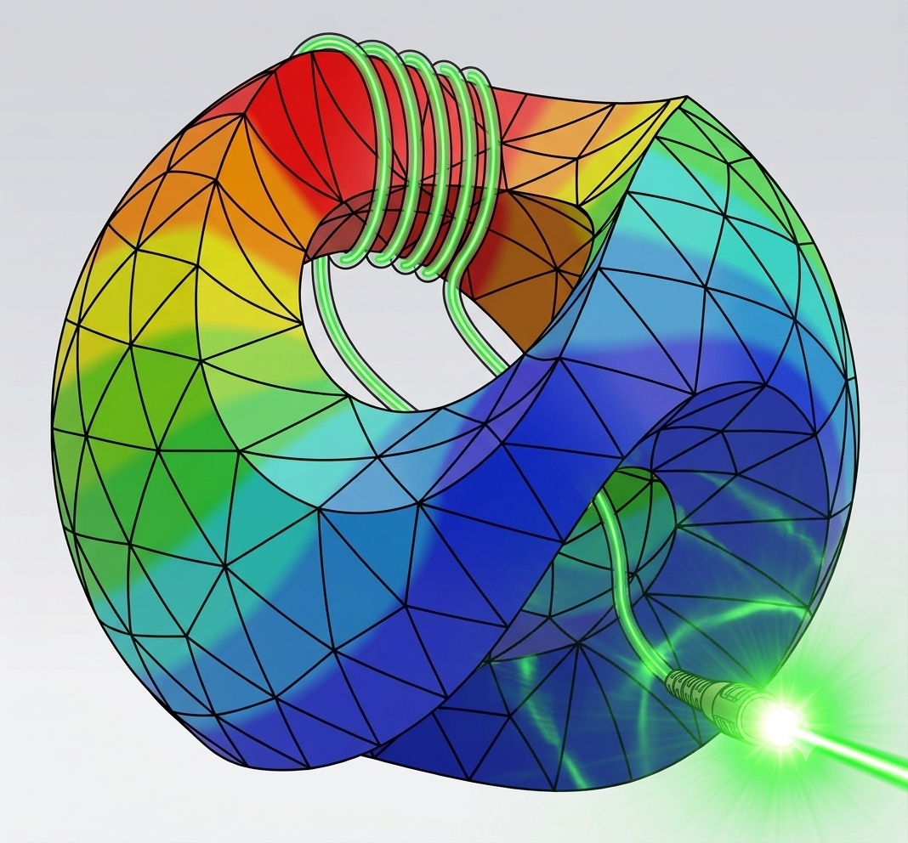

<table>
<tr>
<td valign="top" width="65%" style="border: none">
<h1>Computing Optical Fiber Modes Using <code>fibermode</code></h1>

<br>
This code repository contains `fibermode`, a Python package for
computing guided and leaky modes of optical fibers. It provides both
semi-analytical closed-form solutions and numerical solutions based on
finite element discretizations of the scalar Helmholtz and vector
Maxwell curl-curl eigenproblems. The numerical facilities are based on
finite elements and are built atop NGSolve (https://ngsolve.org). The
eigensolver is the FEAST contour integral eigensolver.

</td>
<td valign="middle" align="center" width="35%" style="border: none">

</td>
</tr>
</table>

## Capabilities

**Semi-analytical methods**

- LP modes of step-index fibers via characteristic equations and Bessel
  functions — `StepIndexExact`
- Scalar and vector leaky modes of Bragg fibers via the transfer matrix
  method — `BraggExactScalar`, `BraggExactVector`

**Numerical methods (FEM + FEAST)**

- Guided and leaky modes (scalar and vector) of arbitrary fiber geometries, including 
  - step-index fibers — `StepIndex`,
  - Bragg fibers — `Bragg`,
  - antiresonant fibers — `ARF`, `NANF`,
  - photonic bandgap fibers — `PBG`.


Key algorithmic features include the  FEAST polynomial eigensolver with contour integration in the complex plane,  a frequency-dependent PML for accurate leaky mode eigenvalues, nondimensional *Z*-plane formulation to avoid numerical round-off in large  eigenvalue problems, confinement loss (dB/m) computed directly from complex propagation constants, and mode visualization tools.

## Installation

```
git clone git@github.com:jayggg/fibermode.git
cd fibermode
pip install -e .
```

`pip install -e .` installs `fibermode` in editable mode and pulls in
its PyPI dependencies (`numpy`, `scipy`, `matplotlib`, `sympy`,
`cxroots`) automatically. Two dependencies are deliberately left out
of `install_requires` and must be managed yourself:

- [NGSolve](https://ngsolve.org), a high-performance finite element
  library. Most users already have NGSolve installed (conda, a source
  build, or an MPI/MKL-enabled build) — `pip install ngsolve` would
  fetch an unrelated plain-PyPI copy that can shadow or conflict with
  it, so it's intentionally not listed. If you don't have NGSolve yet,
  `pip install ngsolve` is fine.
- [pyeigfeast](https://bitbucket.org/jayggg/pyeigfeast/src/master/),
  which implements the FEAST polynomial eigensolver for NGSolve. It
  has no PyPI release and no `setup.py`, so `pip` cannot install it
  regardless — clone it and add it to your `PYTHONPATH`:

  ```
  git clone git@bitbucket.org:jayggg/pyeigfeast.git
  export PYTHONPATH="$PWD/pyeigfeast:$PYTHONPATH"
  ```

(If you don't want an editable install, `pip install .` works too, but
since this is an actively developed research codebase, `-e` is
recommended so local edits take effect without reinstalling.)

## Quick start

```python
from fibermode import StepIndexExact, StepIndex, Bragg, BraggExactScalar

# Semi-analytical LP modes of a named fiber
f = StepIndexExact('Nufern_Yb')
betas = f.XtoBeta(f.propagation_constants(ell=0))

# Numerical guided modes (FEM + FEAST)
fiber = StepIndex(fibername='Nufern_Yb')
betas, zsqrs, modes = fiber.guidedmodes(p=3)
```

Further simple demos are available at the `demos` folder.


## Documentation & Tutorial Notebooks

Browse [tutorial notebooks online](https://jayggg.github.io/fibermode/README.html). The notebooks can also be found in the `docs` folder. Additionally, the `demos` folder contain simple python scripts. 


## Cite

If you use `fibermode` in your research or teaching, please cite it:

```bibtex
@misc{fibermode,
  author       = {Gopalakrishnan, Jay},
  title        = {Computing Optical Fiber Modes Using \texttt{fibermode}},
  howpublished = {\url{https://github.com/jayggg/fibermode}},
  year         = {2026}
}
```

## License

Write to  [Jay Gopalakrishnan](https://web.pdx.edu/~gjay/)
for consultations, bug reports and suggestions. Pull requests  are welcome at
<https://github.com/jayggg/fibermode>.
Code and documentation 
are released under the [MIT License](LICENSE).
